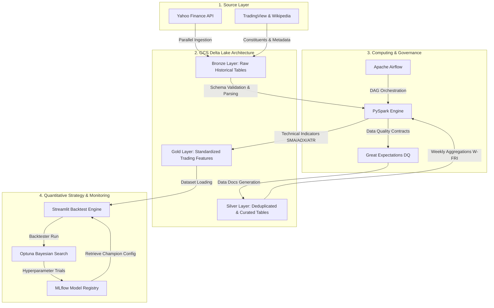

# 🚀 Momentum AI — Algorithmic Strategy with Optuna & MLflow

[](file:///Users/forget/Desktop/Project_Momentum_AI/requirements.txt)
[](file:///Users/forget/Desktop/Project_Momentum_AI/requirements.txt)
[](file:///Users/forget/Desktop/Project_Momentum_AI/requirements.txt)
[](file:///Users/forget/Desktop/Project_Momentum_AI/src/common/quality_manager.py)
[](file:///Users/forget/Desktop/Project_Momentum_AI/docker-compose.yml)
[](file:///Users/forget/Desktop/Project_Momentum_AI/airflow/dags/dag_bronze.py)
[](file:///Users/forget/Desktop/Project_Momentum_AI/README.md)

An industrial-grade, robust quantitative trading platform implementing a **Regime-Switching Momentum Strategy**, scientifically optimized via Bayesian search and audited in real-time through strict data contracts.

---

## 1. Business Pitch & Value Proposition

### The Business Problem
In the asset management industry, traditional momentum strategies suffer from two critical flaws: **survivorship bias** (which invalidates most academic backtests by ignoring companies that have been delisted) and **brutal trend reversals (drawdowns)** during bear markets. These factors degrade the risk-adjusted return profile and prevent the deployment of real capital.

**Momentum AI solves this problem through three pillars of quantitative engineering:**
1. **Survivorship Bias Eradication**: Ingests a dynamic historical universe tracking all **1,170+ historical members** of the S&P 500 over the past 50 years, rather than just the 500 currently active members.
2. **Dynamic Regime Switching**: An algorithmic market regime detector (Bull vs. Bear) that dynamically shifts capital into a leveraged **Top N Stocks** basket during up-trends, or retreats to **hedging ETFs (Gold, Bonds)** and **interest-bearing Cash** during down-trends.
3. **Calmar-Driven Optimization Engine**: Automated Bayesian optimization via [Optuna](file:///Users/forget/Desktop/Project_Momentum_AI/requirements.txt) designed to maximize the Calmar Ratio ($\text{CAGR} / \text{Max Drawdown}$), ensuring maximum risk-adjusted performance.

---

## 2. Architecture & Data Flow

The project is structured around a **Medallion Architecture (Bronze/Silver/Gold)** powered by Apache Spark and materialized as Delta tables on Google Cloud Storage (GCS).



### Stack Rationalization

| Technology | Component | Technical / Business Justification |
| :--- | :--- | :--- |
| **PySpark (v3.5.3)** | Computing Engine | Highly performant parallel processing of 50 years of daily pricing ticks for over 1,100 assets, eliminating RAM bottlenecks inherent in single-node Pandas. |
| **Delta Lake (v3.2.1)** | Storage Format | Full ACID guarantees on GCS, enabling incremental daily `Merge (Upsert)` operations without risk of historical data corruption. |
| **Great Expectations (v1.x)** | Data Quality | Strict "Data Contracts". Blocks the pipeline if raw feeds contain pricing anomalies (e.g., zero volume, null values), protecting the optimizer from false signals. |
| **Optuna & MLflow** | Optimization & Tracking | Tree-structured Parzen Estimator (TPE Sampler) for bayesian parameter search, coupled with structured experiment tracking to compare and deploy the "Champion" model. |
| **Apache Airflow** | Orchestration | Automates the weekly ingestion and parameter tuning workflow, keeping the strategy signals continuously fresh and actionable. |
| **Streamlit** | Dashboard Interface | Empowers portfolio managers to run interactive backtests, visualize equity curves, customize leverage, and load the MLflow champion parameters in one click. |

---

## 3. Getting Started & Reproducibility

### System Requirements
- **Python Runtime**: `Python >= 3.10` and `Python <= 3.12` (Recommended: `3.10`)
- **Java Runtime**: `OpenJDK 17` (Mandatory for running PySpark jobs locally)
- **Container Runtime**: `Docker >= 20.10` and `Docker Compose >= 2.0`

### Step-by-Step Installation

1. **Clone the Repository**:
   ```bash
   git clone https://github.com/TwingzChenou/Momentum_AI.git
   cd Momentum_AI
   ```

2. **Configure Virtual Environment**:
   ```bash
   python3 -m venv .venv
   source .venv/bin/activate
   pip install --upgrade pip
   pip install -r requirements.txt
   ```

3. **Configure Environment Variables**:
   Copy the environment variables template and configure it with your active credentials:
   ```bash
   cp .env.example .env
   ```

Here is what your finalized local `.env` should look like:
```ini
# ==============================================================================
# Momentum AI - Production Environment Configuration (.env)
# ==============================================================================

# --- GOOGLE CLOUD PLATFORM (GCP) CONFIGURATION ---
GCP_PROJECT_ID="finance-ml-project-486410"
BUCKET_NAME="finance-data-lake-unique-id"
GCP_KEY_PATH="./config/keys_gcp/finance-ml-project-486410-f5aa9a641051.json"

# --- GCS INTEROPERABILITY KEYS (HMAC FOR SPARK/DELTA COMPATIBILITY) ---
GCS_ACCESS_KEY_ID="GOOG_ACCESS_KEY_ID_PLACEHOLDER"
GCS_SECRET_ACCESS_KEY="gcs_secret_access_key_placeholder_value_here"

# --- APACHE SPARK CONFIGURATION ---
# Ensure this points to your active virtualenv or JDK home
JAVA_HOME="/opt/homebrew/Caskroom/miniforge/base/envs/ml-prod"

# --- MLFLOW SERVICE TRACKING ---
MLFLOW_TRACKING_URI="http://localhost:5001"
```

4. **Launch the Container Stack (Docker)**:
   Spin up the Streamlit dashboard, MLflow registry, and Great Expectations docs server in the background:
   ```bash
   docker-compose up -d --build
   ```

5. **Access Application Interfaces**:
   - 📊 **Streamlit Backtest App**: [http://localhost:8501](http://localhost:8501)
   - 🧪 **MLflow Tracking Server**: [http://localhost:5001](http://localhost:5001)
   - 🛡️ **Great Expectations Data Docs**: [http://localhost:8082](http://localhost:8082)

---

## 4. Quality & Governance (Data Contracts)

Data quality and pipeline governance are strictly managed by the [QualityManager](file:///Users/forget/Desktop/Project_Momentum_AI/src/common/quality_manager.py) class, which utilizes the Great Expectations 1.x Fluent API.

### Enforced Data Contracts
- **Bronze/Silver Prices Check**: 
  - Non-nullity of adjusted closing prices (`Close`) checked against a strict 95% threshold (flagging rate limits or unlisted tickers).
  - Validation of realistic price boundaries ($0.01 to $50,000).
  - Verification of trading activity (prevents volume from being constantly 0).
- **Gold Technical Check**:
  - Validation of technical metrics (e.g., ADX values must lie strictly between 0 and 100).
- **Ticker List Check**:
  - Uniqueness and non-nullity of ingested symbols in the stock universe.
  - Verification of positive market capitalization.
  - Requirements for international suffixes (Regex) to ensure global index representation.

### Running Quality Audits Locally

To run the data quality checks manually and build the visual HTML Data Docs:
```bash
python3 scripts/maintenance/run_data_audit.py
```

To run linting and code formatting checks:
```bash
# Code style audit (PEP 8) using ruff
ruff check src/

# Auto-format codebase
ruff format src/
```

---

## 5. Testing Strategy

The pipeline features a robust testing suite divided into:
1. **Integration Tests**: Auditing asynchronous connectivity and concurrency handling for third-party financial APIs (Yahoo Finance) using `aiohttp` and `asyncio`.
2. **Strategy Unit Tests**: Simulating financial calculations, including position weights, transactional costs, and trailing ATR stop loss triggers.

### Running the Test Suite

To run the standard data quality audit script:
```bash
python3 scripts/maintenance/run_data_audit.py
```

To run the unit tests and generate a full coverage report:
```bash
# Execute unit tests with pytest
pytest -v

# Generate a detailed HTML coverage report
pytest --cov=src --cov-report=html tests/
```
The coverage report is generated locally at `./htmlcov/index.html`.

---

## 6. Performance, Limits & Assumptions

### Performance Metrics
- **Bronze Ingestion Pipeline**: Parallel chunked ingestion via threads running in **~10 seconds** per 100 tickers, preventing rate-limiting blocks.
- **Silver & Gold Processing**: PySpark computations of indicators (SMA, ADX, ATR, Momentum) for 20 years of weekly data across 1,170+ tickers executes in **~45 seconds**.
- **Bayesian Optimization (Optuna)**: Running **50 complete backtest trials** (GCS loading, portfolio simulation, transactional cost calculations, and risk metric aggregation) completes in **~2 minutes**.

### Design Assumptions
- **Dividends & Splits Adjusted**: Backtests rely strictly on the `AdjClose` column built at the Silver layer to filter out artificial price gaps caused by corporate actions.
- **Weekly Rebalancing (W-FRI)**: Portfolio simulations and signals execute weekly at Friday market close (W-FRI) to filter daily market noise and reduce transaction costs.
- **Active GCP Key**: Distributed processing assumes a valid GCP Service Account JSON key exists in `config/keys_gcp/` with `Storage Admin` and `BigQuery Admin` roles.

### Known Limitations
- **Flat-Rate Transaction Fees**: Transaction fees are currently modeled as a flat percentage of traded volume (0.1% by default). Market impact (slippage) for large order sizes is not simulated.
- **Long-Only Strategy**: The backtest engine currently only permits buying assets (long-only). Short selling and derivatives hedging are not supported.
- **At-Close Execution**: Trades are assumed to execute exactly at the Friday closing price, assuming no operational latency or market lag.

---

> **Note for the Quant Engineering Team**: For any updates to technical indicator features, ensure corresponding expectations are updated in [quality_manager.py](file:///Users/forget/Desktop/Project_Momentum_AI/src/common/quality_manager.py) to prevent upstream pipeline failures.
