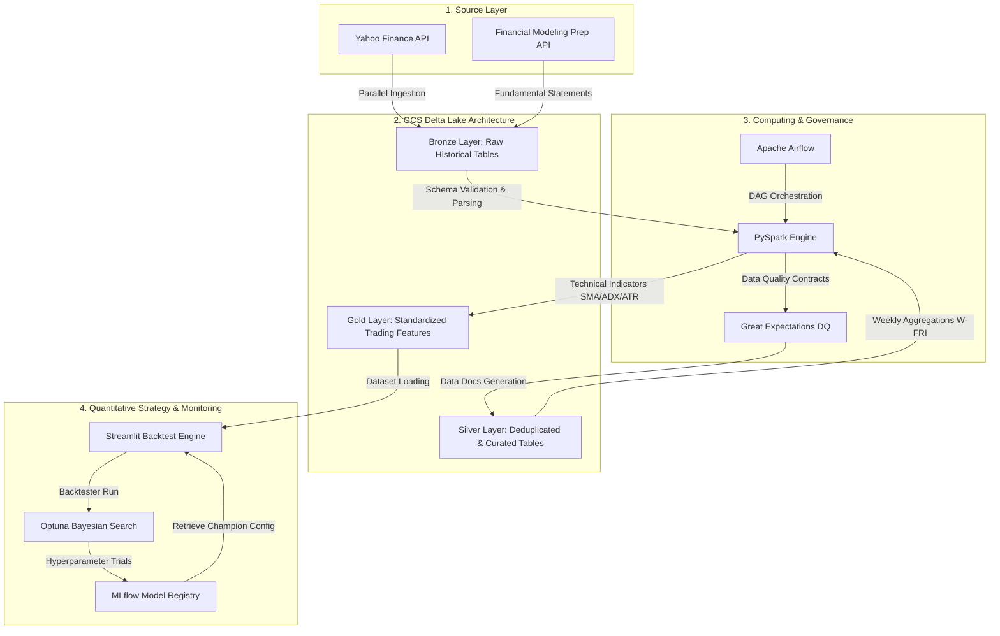

# 🚀 Momentum AI — Algorithmic Strategy with Optuna & MLflow

[](file:///Users/forget/Desktop/Project_Momentum_AI/requirements.txt)
[](file:///Users/forget/Desktop/Project_Momentum_AI/requirements.txt)
[](file:///Users/forget/Desktop/Project_Momentum_AI/requirements.txt)
[](file:///Users/forget/Desktop/Project_Momentum_AI/src/common/quality_manager.py)
[](file:///Users/forget/Desktop/Project_Momentum_AI/docker-compose.yml)
[](file:///Users/forget/Desktop/Project_Momentum_AI/airflow/dags/dag_bronze.py)
[](file:///Users/forget/Desktop/Project_Momentum_AI/README.md)

Une plateforme industrielle et robuste de trading quantitatif implémentant une **stratégie de momentum à changement de régime (Regime-Switching)**, optimisée scientifiquement par recherche bayésienne et auditée en continu par des contrats de données stricts.

---

## 1. Pitch Business & Impact Métier

### Le Problème Métier
Dans le secteur financier et la gestion d'actifs, les stratégies de momentum traditionnelles souffrent de deux faiblesses critiques : **le biais de survie (survivorship bias)** (qui invalide la plupart des backtests académiques en ignorant les entreprises radiées de la cote) et les **retournements brutaux de marché (drawdowns)** lors des phases de krach (Bear markets). Ces faiblesses détruisent le ratio rendement/risque et empêchent la mise en production de capital réel.

**Momentum AI résout ce problème à travers trois piliers d'ingénierie quantitative :**
1. **Éradication du Biais de Survie** : L'ingestion d'un univers historique dynamique intégrant l'intégralité des **1170+ membres historiques** ayant fait partie de l'indice S&P 500 au cours des 50 dernières années (et non pas uniquement les 500 membres actuels).
2. **Couverture de Régime Dynamique** : Une détection algorithmique du régime macro-économique global (Bull vs. Bear) réallouant instantanément le capital vers un **Top N Actions** à fort momentum en phase haussière, ou se repliant vers des **ETFs de couverture (Or, Obligations)** ou en **Cash rémunéré** en phase de marché baissier.
3. **Moteur d'Optimisation par Score de Calmar** : Une recherche bayésienne automatisée via [Optuna](file:///Users/forget/Desktop/Project_Momentum_AI/requirements.txt) visant à maximiser le ratio de Calmar ($\text{CAGR} / \text{Max Drawdown}$), garantissant un retour sur investissement maximal pour chaque unité de risque historique acceptée.

---

## 2. Architecture & Data Flow

Le projet est conçu autour d'une architecture de type **Medallion (Bronze/Silver/Gold)** exécutée de façon hautement distribuée par Apache Spark et matérialisée dans Google Cloud Storage (GCS) au format Delta Lake.



### Justification de la Stack Technique

| Technologie | Composant clé | Justification Métier / Technique |
| :--- | :--- | :--- |
| **PySpark (v3.5.3)** | Moteur de Calcul | Traitement parallèle hautement performant de 50 ans d'historique de ticks journaliers pour plus de 1 100 tickers, éliminant les limites de mémoire vive inhérentes à Pandas. |
| **Delta Lake (v3.2.1)** | Format de Stockage | Garantie des propriétés ACID sur GCS, permettant des opérations de `Merge (Upsert)` incrémentielles quotidiennes fiables sans risque de corruption des données historiques. |
| **Great Expectations (v1.x)** | Data Quality | Implémentation de "Data Contracts" stricts. Bloque automatiquement la pipeline si le flux de prix contient des anomalies (ex: prix nuls, volume gelé) protégeant le backtest des faux signaux. |
| **Optuna & MLflow** | Optimisation & Suivi | Algorithme d'optimisation bayésienne (TPE Sampler) couplé à un registre d'expériences structuré pour tracer, comparer et déployer la configuration de stratégie "Championne". |
| **Apache Airflow** | Orchestrateur | Automatisation de la pipeline d'ingestion et d'optimisation hebdomadaire, assurant la fraîcheur constante des signaux opérationnels. |
| **Streamlit** | Interface d'Exploitation | Permet aux équipes de gestion de portefeuille de visualiser les courbes d'équité, de modifier manuellement les paramètres de levier, et de charger la configuration championne en un clic. |

---

## 3. Getting Started & Reproductibilité

### Prérequis Système
- **Runtime Python** : `Python >= 3.10` et `Python <= 3.12` (Recommandé : `3.10`)
- **Runtime Java** : `OpenJDK 17` (Indispensable pour exécuter les workloads PySpark locaux)
- **Runtime Conteneurs** : `Docker >= 20.10` et `Docker Compose >= 2.0`

### Installation Pas à Pas

1. **Cloner le Dépôt** :
   ```bash
   git clone https://github.com/TwingzChenou/Momentum_AI.git
   cd Momentum_AI
   ```

2. **Configurer l'Environnement Virtuel** :
   ```bash
   python3 -m venv .venv
   source .venv/bin/activate
   pip install --upgrade pip
   pip install -r requirements.txt
   ```

3. **Configurer les Variables d'Environnement** :
   Copiez le fichier de configuration template et complétez-le avec vos identifiants réels :
   ```bash
   cp .env.example .env
   ```

Voici à quoi doit ressembler votre fichier `.env` final :
```ini
# ==============================================================================
# Momentum AI - Production Environment Configuration (.env)
# ==============================================================================

# --- FINANCIAL MODELING PREP API ---
FMP_API_KEY="your_fmp_api_key_placeholder"  

# --- GOOGLE CLOUD PLATFORM (GCP) CONFIGURATION ---
GCP_PROJECT_ID="finance-ml-project-486410"
BUCKET_NAME="finance-data-lake-unique-id"
GCP_KEY_PATH="./config/keys_gcp/finance-ml-project-486410-f5aa9a641051.json"

# --- GCS INTEROPERABILITY KEYS (HMAC FOR SPARK/DELTA COMPATIBILITY) ---
GCS_ACCESS_KEY_ID="GOOG_ACCESS_KEY_ID_PLACEHOLDER"
GCS_SECRET_ACCESS_KEY="gcs_secret_access_key_placeholder_value_here"

# --- APACHE SPARK CONFIGURATION ---
# Assurez-vous que cette variable pointe vers l'environnement actif
JAVA_HOME="/opt/homebrew/Caskroom/miniforge/base/envs/ml-prod"

# --- MLFLOW SERVICE TRACKING ---
MLFLOW_TRACKING_URI="http://localhost:5001"
```

4. **Lancement de l'Infrastructure Complète (Docker)** :
   Démarrez les services Streamlit, MLflow et le serveur de documentation Great Expectations en arrière-plan :
   ```bash
   docker-compose up -d --build
   ```

5. **Accéder aux Services** :
   - 📊 **Interface Backtest (Streamlit)** : [http://localhost:8501](http://localhost:8501)
   - 🧪 **Tracking des Expériences (MLflow)** : [http://localhost:5001](http://localhost:5001)
   - 🛡️ **Rapports Qualité (Data Docs GX)** : [http://localhost:8082](http://localhost:8082)

---

## 4. Quality & Governance (Contrôle Qualité)

La gouvernance et la qualité des données financières sont gérées par la classe [QualityManager](file:///Users/forget/Desktop/Project_Momentum_AI/src/common/quality_manager.py) qui orchestre l'API Great Expectations 1.x Fluent. 

### Data Contracts Enforcés
- **Bronze/Silver Prices Check** : 
  - Non-nullité des prix ajustés (`Close`) sur un seuil strict de 95% (permettant d'exclure automatiquement les erreurs d'ingestion type ticker non trouvé ou problème de Rate Limit).
  - Validation des bornes réalistes des prix (compris strictement entre $0.01 et $50,000).
  - Vérification de l'activité des flux de données financiers (interdiction d'avoir un volume d'échange constamment égal à zéro).
- **Gold Technical Check** :
  - Validation géométrique des indicateurs comme l'ADX (qui doit être strictement compris entre 0 et 100).
- **Ticker List Check** :
  - Non-nullité et unicité des symboles ingérés dans l'univers de trading.
  - Vérification de la capitalisation boursière positive.
  - Présence obligatoire de suffixes internationaux (Regex) pour garantir l'inclusion hors USA dans l'univers d'investissement.

### Exécuter les vérifications de qualité en local

Pour valider l'intégrité de la pipeline et générer les rapports visuels (Data Docs), exécutez le script d'audit des données :
```bash
python3 scripts/maintenance/run_data_audit.py
```

Pour effectuer les vérifications de formatage de code (Linter/Formatter) :
```bash
# Vérifier la conformité de style (PEP 8) avec ruff
ruff check src/

# Formater automatiquement le code
ruff format src/
```

---

## 5. Testing Strategy

Le projet met en place une pyramide de tests robuste axée sur :
1. **Tests d'Intégration** : Validation de la connectivité asynchrone des APIs externes (Financial Modeling Prep & Yahoo Finance) sous forte concurrence via `aiohttp` et `asyncio`.
2. **Tests Unitaires de la Stratégie** : Simulation des calculs financiers d'allocation, des frais de courtage et du calcul dynamique du trailing stop loss.

### Exécuter la Suite de Tests

Pour lancer l'audit complet des APIs financières avec diagnostics asynchrones :
```bash
python3 tests/api_fmp_test.py
```

Pour exécuter les tests unitaires et générer un rapport complet de couverture de code :
```bash
# Lancer les tests unitaires avec pytest
pytest -v

# Générer le rapport de couverture
pytest --cov=src --cov-report=html tests/
```
Le rapport HTML de couverture sera matérialisé sous `./htmlcov/index.html`.

---

## 6. Performance, Limits & Assumptions

### Ordres de Grandeur des Performances
- **Pipeline d'Ingestion Bronze** : Ingestion incrémentielle quotidienne multi-tickers parallélisée via Threads en **~10 secondes** pour un chunk de 100 actions, respectant les limites imposées par Yahoo Finance.
- **Silver & Gold Processing** : Calcul distribué Spark de l'ensemble des indicateurs (SMA, ADX, ATR, Momentum) sur 20 ans d'historique hebdomadaire pour 1 170 entreprises exécuté en **~45 secondes**.
- **Recherche Bayésienne (Optuna)** : Exécution de **50 trials complets** de backtest (incluant le chargement des données depuis BigQuery, la simulation de portefeuille hebdomadaire et le calcul des métriques de risque) en **~2 minutes**.

### Hypothèses de Design (Assumptions)
- **Calcul Adjusté** : Le backtester repose exclusivement sur la colonne `AdjClose` (prix ajusté des dividendes et splits d'actions) générée à l'étape Silver pour éviter les faux signaux de momentum fictifs créés par les détachements de coupons ou les divisions de titres.
- **Fréquence Hebdomadaire** : Bien que les données Bronze soient quotidiennes, la simulation de portefeuille et les rééquilibrages s'effectuent tous les **vendredis soirs (W-FRI)** à la clôture, pour filtrer le "bruit" quotidien du marché et réduire considérablement les coûts de transaction du fonds.
- **Clé GCP active** : Le bon fonctionnement du stockage distribué présuppose la présence d'une clé de compte de service GCP valide dotée des rôles `Storage Admin` et `BigQuery Admin` placée dans `config/keys_gcp/`.

### Limitations Connues
- **Frais de courtage forfaitaires** : Les frais de transaction sont actuellement modélisés par un pourcentage fixe constant par transaction (ex: 0.1% par défaut). Le glissement de prix (*slippage*) lié à l'impact de marché sur de très gros volumes n'est pas modélisé.
- **Régime Long-Only** : Le moteur n'autorise que les positions longues (acheteuses). La vente à découvert (*short selling*) n'est pas supportée dans le cadre de cette allocation de régime.
- **Execution à la clôture** : Les ordres sont supposés être exécutés exactement au cours de clôture du jour de signal, sans temps de latence opérationnelle (*market lag*).

---

> **Note de l'équipe d'Ingénierie Quantitative** : Pour toute évolution majeure de la logique de calcul des features, veuillez mettre à jour les schémas Great Expectations correspondants dans [quality_manager.py](file:///Users/forget/Desktop/Project_Momentum_AI/src/common/quality_manager.py) pour éviter toute rupture de contrat de données en aval.
